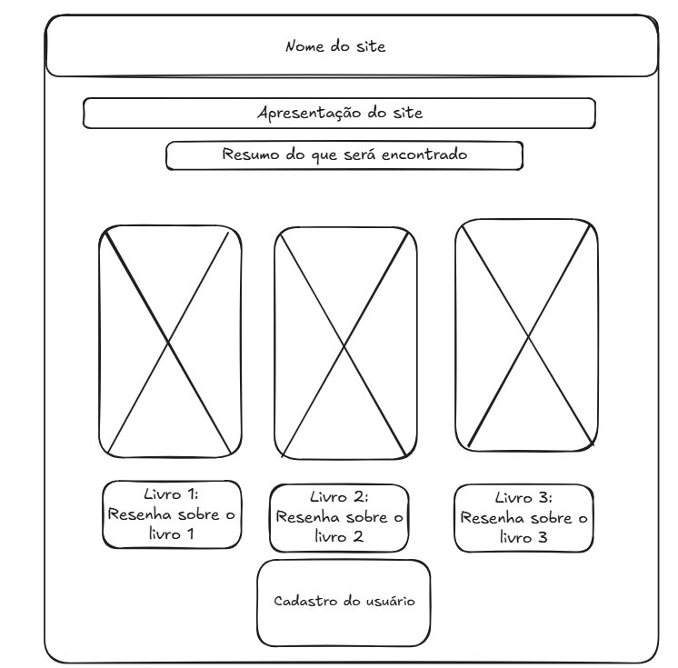
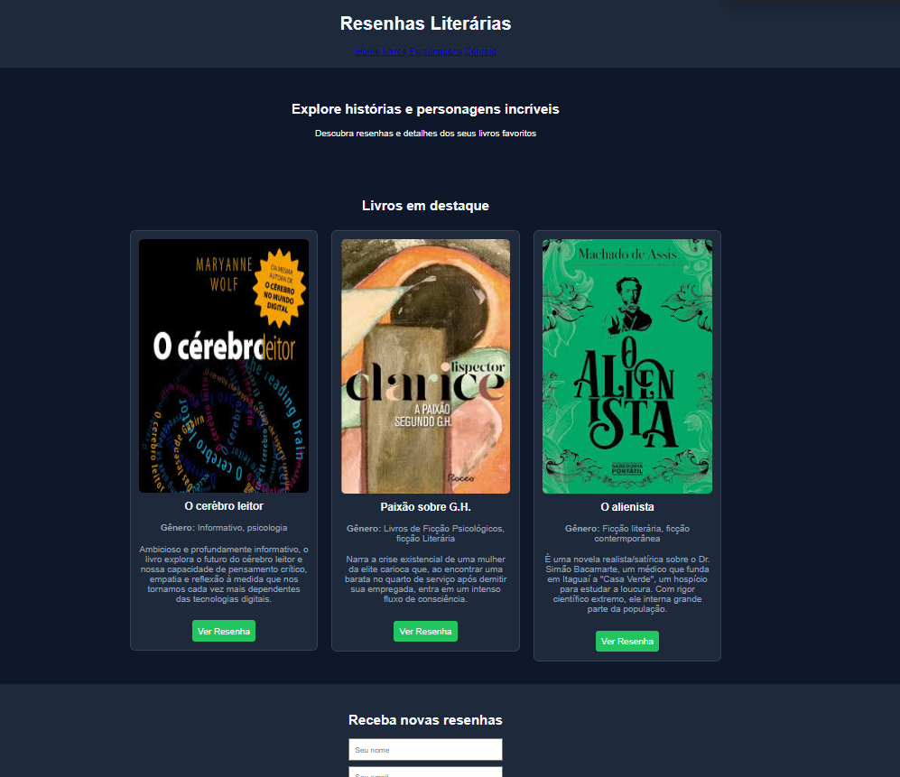

# Trabalho Prático - Semana 4 
> DWFE 2026/1

Dessa vez, vamos escolher uma proposta de projeto para trabalhar.

Nessa atividade, você deverá montar a página inicial do projeto escolhido, a organização do HTML aplicando semântica correta e uso aprimorado do CSS. Leia o enunciado completo no Canvas para mais detalhes.

**IMPORTANTE:** Você deve trabalhar e alterar apenas arquivos dentro da pasta **`public`**. Deixe todos os demais arquivos e pastas desse repositório inalterados. **PRESTE MUITA ATENÇÃO NISSO.**

## Informações Gerais

- Nome: Luiz Gustavo Campos Andrade
- Matricula: 928390
- Proposta de projeto escolhida: Pesoas e produções
- Breve descrição sobre seu projeto: O projeto consiste em apresentar resenhas literárias. O objetivo é que o usuário possa visualizar diferentes livros e detalhes sobre eles: breve resumo sobre a história, genêro literário, personagens e detalhes sobre o autor e suas obras.

## Print do(s) wireframe(s) criado
> Sugestão, use o Excalidraw para isso. Utilize esse [template básico](https://excalidraw.com/#json=LU-8hwcQEwzk11FwO8Opo,qPU9K6cNUEzlXzwOuKMIlQ) para você começar.

## Print da home-page criada

